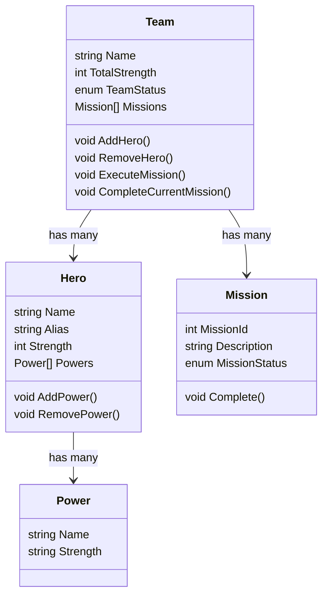
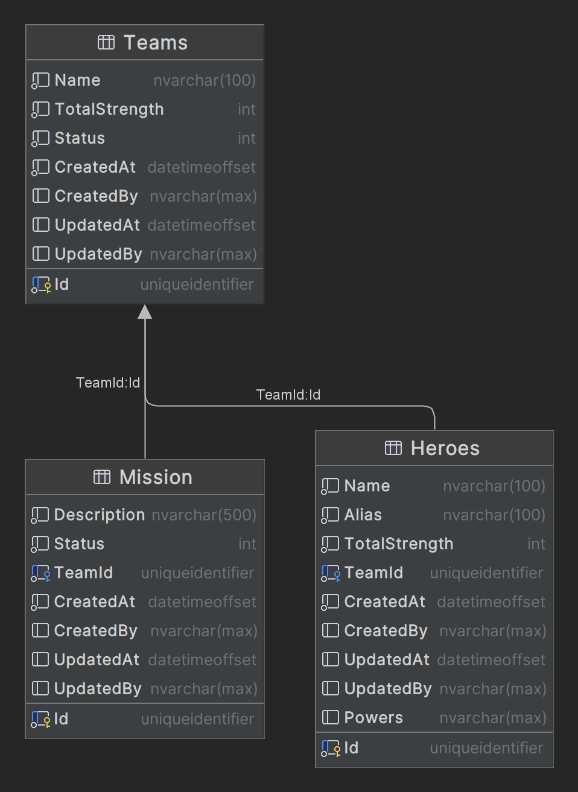

# SuperHero Domain Model

- `Hero` - Aggregate
- `Team` - Aggregate
- `Power` - ValueObject
- `Mission` - Entity
- `HeroPowerUpdated` - Domain Event (updates the TotalPowerLevel on the SuperHeroTeam)

## Database Schema

